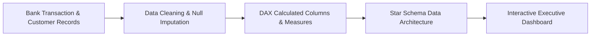

# 🏦 Allahabad Bank Financial Operations & Risk Analytics Dashboard


---

## 📌 Executive Summary

An interactive **Power BI Financial & Risk Analytics Dashboard** designed for Allahabad Bank customer demographics, loan portfolio risk, and credit performance. The dashboard enables bank managers to evaluate loan approval ratios, credit score risk bands, customer churn risk factors, and interest income distributions.

---

## ⚙️ Analytical Pipeline



---

## 💡 Key Business Metrics & Insights

- **💳 Credit Score Risk Segmentation:** Categorized borrowers into Excellent, Good, Fair, and High-Risk tiers to reduce default probability.
- **📉 Churn Risk Identification:** Identified account balance and tenure thresholds strongly correlated with customer attrition.
- **💰 Loan Portfolio Performance:** Visualized approval rates, default rates, and interest earnings across different branch regions.
- **🎯 Customer Demographics:** Segmented active vs inactive account holders across age brackets and income groups.

---

## 🛠️ Tools & Technologies

- **Business Intelligence:** Power BI Desktop
- **Data Modeling:** DAX (Data Analysis Expressions), Related Tables, Star Schema
- **Data Preparation:** Power Query, Excel Pivot Tables

---

## 🚀 How to Explore the Dashboard

1. **Clone the repository:**
   ```bash
   git clone https://github.com/sharvesh-analytics/Allahabad_Bank_Details_Data_Dashboard.git
   ```
2. **Open Dashboard:**
   - Double-click the `.pbix` file to open in **Power BI Desktop**.

---

### 👤 Author
**Sharvesh Pandey** | [LinkedIn](https://www.linkedin.com/in/sharvesh-analytics) | [GitHub Profile](https://github.com/sharvesh-analytics)
